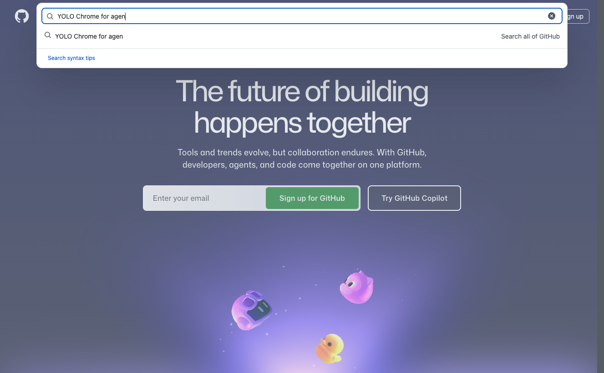
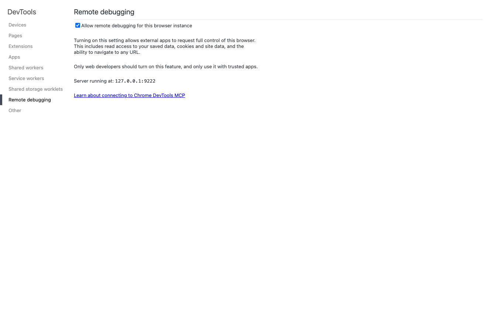
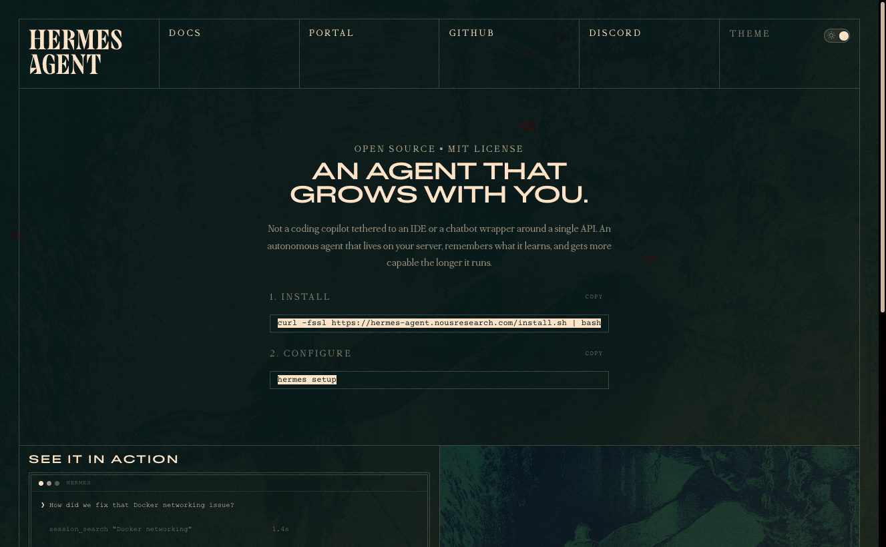

# Chrome for Agents

Give your AI agent full access to your live Chrome browser — existing tabs, saved logins, cookies, and all — without restarting Chrome, creating separate profiles, or re-authenticating anything.



## Why This Exists

Most AI agent browser tools launch a headless or isolated browser instance. That means:

- No saved passwords or cookies — you re-login to everything
- No access to already-open tabs
- Bot detection flags headless Chrome immediately (eBay, Amazon, etc.)
- You can't see what the agent is doing or intervene

This setup uses the **Chrome DevTools MCP server** to attach your agent to your *already-running* Chrome session. You keep full visibility and control — the agent acts inside your real browser.

## Human-in-the-Loop: Your Secret Weapon

Because the browser is *yours* — visible, real, and running — you can jump in at any moment. This is the biggest advantage over headless approaches:

- **CAPTCHAs** — Agent hits a CAPTCHA? You click the checkbox. It's sitting right there in your browser.
- **Anti-bot challenges** — Cloudflare, Incapsula, and similar protections see a real Chrome session with real cookies and browsing history. No fingerprint spoofing needed.
- **Credential entry** — 2FA prompts, password managers, biometric auth — your meat-sack appendages handle what silicon can't.
- **Approval gates** — See exactly what the agent is about to submit before it happens. Your mouse is right there.
- **Recovery** — Agent gets stuck on an unexpected modal or popup? You dismiss it and let it continue.

This isn't a workaround — it's the architecture. The agent drives, you co-pilot. Headless browsers try to solve these problems with increasingly fragile automation. We just let the human be human.

## How It Works

```
Agent (Hermes/Claude/etc.)
    ↕ MCP Protocol
chrome-devtools-mcp server (Node.js)
    ↕ Chrome DevTools Protocol
Your running Chrome (v144+)
    ↕
Your real tabs, cookies, logins
```

The `chrome-devtools-mcp` server is an official Google project ([ChromeDevTools/chrome-devtools-mcp](https://github.com/ChromeDevTools/chrome-devtools-mcp)) that bridges the MCP (Model Context Protocol) to Chrome's DevTools Protocol. The `--autoConnect` flag (Chrome M144+) lets it attach to your running Chrome without requiring a debug port launch.

## Prerequisites

- **Chrome 144+** — check at `chrome://version`
- **Node.js 20.19+** — `node --version`
- An MCP-compatible agent (Hermes, Claude Desktop, Cursor, etc.)

## Setup

### Fastest install (Hermes)

Run this one-liner:

```bash
curl -fsSL https://raw.githubusercontent.com/telos-oc/chrome-for-agents/main/install-hermes.sh | bash
```

What it does:
- Checks **Python 3**, **Node.js 20.19+**, **npx**, **Hermes**, and **Chrome/Chromium 144+**
- Adds or updates the `chrome-devtools` MCP server in `~/.hermes/config.yaml`
- Verifies the config was written correctly
- Verifies `chrome-devtools-mcp@latest` resolves via `npx`
- Restarts the Hermes gateway

The installer is **idempotent** — re-running it updates the managed `chrome-devtools` entry without duplicating it.

If you prefer to inspect the script before running it:

```bash
curl -fsSL https://raw.githubusercontent.com/telos-oc/chrome-for-agents/main/install-hermes.sh -o install-hermes.sh
bash install-hermes.sh
```

### Manual install (Hermes)

#### 1. Enable Remote Debugging in Chrome

1. Open Chrome
2. Navigate to `chrome://inspect/#remote-debugging`
3. Enable the "Discover network targets" toggle (if not already on)



That's it. No Chrome restart needed, no special launch flags, no separate profile.

#### 2. Configure the MCP Server

Add to `~/.hermes/config.yaml` under `mcp_servers`:

```yaml
mcp_servers:
  chrome-devtools:
    command: npx
    args:
      - -y
      - chrome-devtools-mcp@latest
      - --autoConnect
      - --no-usage-statistics
    timeout: 120
    connect_timeout: 60
```

Then restart the gateway:
```bash
hermes gateway restart
```

### Verify It Works

1. Open Chrome to `chrome://inspect/#remote-debugging`
2. Make sure **Discover network targets** is enabled
3. Keep at least one Chrome tab open
4. Ask Hermes to list browser tabs
5. When Chrome shows the consent prompt, click **Allow**

If Hermes returns your existing Chrome tabs, you're connected.

### Approve the Connection

On first use, Chrome will show a consent prompt asking you to approve the remote debugging attachment. Click **Allow**.

> **Note:** This approval prompt may reappear after restarting your Mac or Chrome — it's a one-time consent per session, not a permanent grant. Just click Allow again when it pops up.

This is your security gate — the agent can't connect to your browser without your explicit approval each session.

## What the Agent Can Do

Once connected, the agent gets ~29 tools including:

| Capability | Examples |
|-----------|----------|
| **Navigation** | Go to URL, open new tabs, close tabs, switch between tabs |
| **Interaction** | Click elements, fill forms, type text, hover, drag, press keys |
| **Inspection** | Take snapshots (accessibility tree), screenshots, read console, monitor network |
| **JavaScript** | Execute arbitrary JS in the page context |
| **Performance** | Run Lighthouse audits, performance traces |
| **File handling** | Upload files to page inputs |

## The Journey: How We Got Here

### Attempt 1: Raw CDP (The Hard Way)

```bash
# Had to fully quit Chrome first
/Applications/Google\ Chrome.app/Contents/MacOS/Google\ Chrome \
  --remote-debugging-port=9222 \
  --user-data-dir=/tmp/chrome-debug-profile &
```

**Problems:**
- Chrome must be fully closed first — can't run alongside your normal browser
- `--user-data-dir` is mandatory (Chrome's multi-profile chooser locks the default directory)
- Separate profile = no existing logins, no cookies, no saved passwords
- Had to use `127.0.0.1` not `localhost` (macOS IPv6 resolution issue)
- Manual credential management via `.env` files for sites with expiring cookies

### Attempt 2: MCP Chrome DevTools (The Easy Way)

```yaml
mcp_servers:
  chrome-devtools:
    command: npx
    args: ["-y", "chrome-devtools-mcp@latest", "--autoConnect"]
```

**What changed:**
- No Chrome restart — attaches to your running session
- All your existing tabs, cookies, and logins are immediately available
- User approval prompt provides a security gate
- Official Google project, well-maintained
- Works with Chrome, Brave, Edge, and other Chromium browsers

## Limitations

- **Chrome 144+ required** — older versions don't support `--autoConnect`
- **Left-click only** — no right-click or middle-click
- **Text entered all at once** — no "type slowly" option
- **No batch actions** — each interaction is a separate tool call
- **No download/PDF interception** — browser handles these natively
- **Chrome must stay running** — if Chrome closes, all browser tools fail
- **Snapshot refs change** — element UIDs update after navigation or major DOM changes; re-snapshot after actions
- **User must approve** — first attach requires manual consent in Chrome

## Security Considerations

This setup gives the agent full access to your real browser session. That means:

- The agent can see your open tabs and their content
- The agent acts with your cookies and authentication state
- Destructive actions (closing tabs, navigating away, submitting forms) affect your real browser
- You should monitor the browser during sensitive operations

The Chrome consent prompt on each session is your primary security gate. If you don't approve, the agent can't connect.

## Tips

1. **Pin important tabs** — the agent can identify tabs by title/URL, so descriptive tab names help
2. **Keep Chrome visible** — part of the value is watching what the agent does
3. **Use for bot-sensitive sites** — this approach passes anti-bot checks that headless browsers fail (eBay, Amazon, etc.)
4. **The `--no-usage-statistics` flag** — prevents the MCP server from sending telemetry to Google

## Troubleshooting

**Agent can't find Chrome:**
- Verify remote debugging is enabled at `chrome://inspect/#remote-debugging`
- Check Chrome version is 144+: `chrome://version`

**Connection hangs:**
- Look for the Chrome consent prompt — it might be hidden behind other windows
- The consent prompt reappears after Mac/Chrome restarts — click Allow again
- Try restarting the MCP server (restart your agent's gateway)

**Agent reports "no pages":**
- Make sure Chrome has at least one tab open
- The MCP server needs a page context to attach to

## Related

- [chrome-devtools-mcp GitHub](https://github.com/ChromeDevTools/chrome-devtools-mcp) — the MCP server
- [Model Context Protocol](https://modelcontextprotocol.io/) — the protocol spec
- [Hermes Agent](https://hermes-agent.nousresearch.com) — the agent framework this was built for


